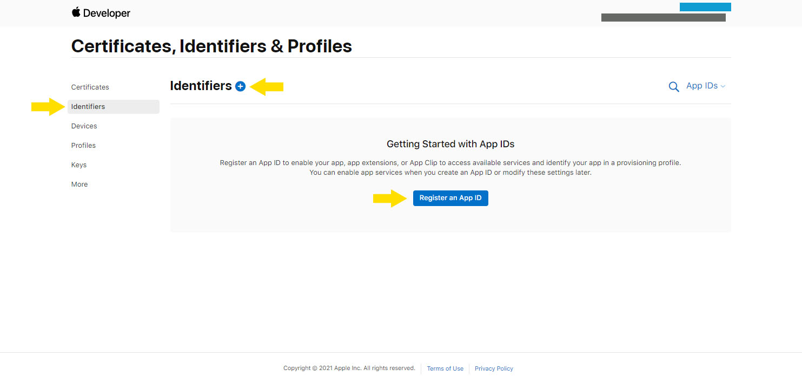

# Philharmonie

Philharmonie is a library that makes it easy to integrate music streaming APIs into your project.
Currently, Philharmonie supports integration with Spotify and Apple Music, allowing you to access and manipulate data from these providers seamlessly.

## Table of Contents

- [Overview](#overview)
- [Installation](#installation)
  - [Prerequisites](#prerequisites)
  - [Install the package](#install-the-package)
  - [Import the Gardrobe and Conductor](#import-the-gardrobe-and-Conductor)
  - [Initialize the Gardrobe](#initialize-the-gardrobe)
  - [Obtain a Token using the client credentials flow](#obtain-a-token-using-the-client-credentials-flow)
  - [Initialize the Conductor](#initialize-the-Conductor)
  - [Make an API withClientCredentials](#make-an-api-withclientcredentials)
- [Gardrobe](#gardrobe)
  - [Initializing the Gardrobe](#initializing-the-gardrobe)
  - [Obtain a Spotify token with Client Credentials flow](#obtain-a-spotify-token-with-client-credentials-flow)
  - [Refresh a Spotify session](#refresh-a-spotify-session)
- [Conductor](#Conductor)
  - [Initializing the Conductor](#initializing-the-Conductor)
  - [Methods of the Providers](#methods-of-the-providers)
    - [Spotify](#spotify)
    - [Apple Music](#apple-music)
- [Error Handling](#error-handling)
- [Repertoire](#repertoire)
- [Contributing](#contributing)
  - [Contribution Guide for the Repertoire](#contribution-guide-for-the-repertoire)
  - [Contribution Guide for the Gardrobe and Conductor](#contribution-guide-for-the-gardrobe-and-conductor)
- [License](#license)
- [Client Credentials Setup Guides](#client-credentials-setup-guides)
  - [Spotify](#spotify-1)
  - [Apple Music](#apple-music-1)

## Overview

Philharmonie consists of two building blocks:

- Gardrobe: Use it to generate tokens with the Client-Credentials flow or extend a session by refreshing a token. This class is initialized using your client credentials and should only be used server-side.

- Conductor: Use it to fetch data from various streaming services, referred to as "providers." This class is initialized without client credentials. Instead, it uses access tokens and thus can be used anywhere.

These two building blocks provide a solid foundation for integrating music streaming data into your project. For tasks requiring single API calls, such as fetching playlist data, Gardrobe and Conductor offer all necessary functionality. For more complex operations, like transferring playlists between services, you can utilize common flows from our Repertoire, which are available for copy-pasting into your project.

Note that user authentication is not included in this package to ensure compatibility with various tech stacks. For API endpoints requiring user authentication, such as adding tracks to a playlist, you must authenticate users through another service and pass the user access token to the Conductor.

## Installation

### Prerequisites

Before you begin, ensure you have obtained your client credentials (ID and SECRET) for the providers you want to use. Refer to the [Client Credentials Setup Guide](https://google.com) for detailed instructions on how to acquire these credentials.

#### Install the package

```bash
  npm install philharmonie

```

#### Import the Gardrobe and Conductor

```java-script
import { createConductor, createGarderobe } from 'philharmonie';
```

#### Initialize the Gardrobe

```java-script
const garderobe = createGarderobe({
  spotify: {
    clientId: AUTH_SPOTIFY_ID,
    clientSecret: AUTH_SPOTIFY_SECRET,
  },
});
```

#### Obtain a Token using the client credentials flow

```java-script
const session = garderobe.spotify.createSession.withClientCredentials();
```

#### Initialize the Conductor

```java-script
export const conductor = createConductor({
  spotify: {
    tokens: {
      accessToken: SPOTIFY_ACCESS_TOKEN,
    },
    defaultMarket: 'US',
  },
});
```

#### Make an API withClientCredentials

```java-script
const playlistData = await conductor.spotify.playlist.getById('playlist-id');
```

And thats it, you have successfully made you first API call using the Conductor.

Now learn more about the [Gardrobe](https://www.google.com) and [Conductor](https://www.google.com) class

## Gardrobe

The Garderobe class provides a structured way to obtain tokens via the client credentials flow and refreshing tokens. It implements providers that follow
OAuth 2 standards. Only Apple does not use this standard, instead they rely on JWT tokens that can't be obtained nor refreshed via an API. For further information on how to obtain these tokens check out the [Client Credential Setup Guide for Apple](https://google.com)

### Initalizing the Gardrobe

To initalize this class you can use the function

```java-script
createGardrobe();
```

You have to pass an object containing the client ids and secrets for every provider you want to use. The Gardroe is ment to be used on the server, where you can use your client secret safely. As of right now, only Spotify is implemented.

```java-script
const garderobe = createGarderobe({
  spotify: {
    clientId: AUTH_SPOTIFY_ID,
    clientSecret: AUTH_SPOTIFY_SECRET,
  },
});
```

Once the class is initalized, you can use it to obtain a token or refresh a token.

#### Obtain a Spotify token with Client Crednetials flow

```java-script
const session = garderobe.spotify.createSession.withClientCredentials();
```

This API call only retruns a accessToken, not a refreshToken.

#### Refresh a Spotify session

```
const refreshedSession = garderobe.spotify.refreshSession('spotify-refresh-token')
```

This API call retruns a accessToken and a refreshToken.

Once you obtained a valid token, you can use it to initalize the Conductor class.

## Conductor

The Conductor class provides methods for interacting with the API endpoints of integrated providers, currently including Spotify and Apple Music.


Before utilizing these methods, it's important to understand three key principles:

- Provider-Specific Structuring: Each provider within the Conductor class mirrors the terminology and structure of its respective API. This design choice ensures consistency and ease of use when accessing different services.

  - Spotify: Refers to audio files as "tracks." To retrieve a track by its ID, use the method:

  ```
    Conductor.spotify.track.getById('spotiy-track-id')
  ```

  - Apple Music: Refers to audio files as "songs" and distinguishes between data stored in the user's library and data from the public catalog. To retrieve data for a public song, use:

  ```
      conductor.appleMusic.song.getCatalogSongById('apple-music-song-id')
  ```

- Market Specification: Due to varying copyright laws and content availability by country, music streaming providers require a market specification to ensure compliance with local regulations. When initializing the Conductor class, you must provide a default market. Each provider also includes a helper method to fetch the current user's market, which can be used for future requests.

- To authenticate requests with provider services, you must provide access tokens, so you must initialize it with the necessary tokens.

  - OAuth Providers: Typically require only an access token to authenticate requests.

  - Apple Music: Requires a developer token for accessing public data. For endpoints involving user-specific actions, such as adding a track to a playlist, both a developer token and a user token are needed. The user token is optional if your application only accesses public data.

### Initalizing the Conductor

To initialize the Conductor class you can use the function

```
createConductor()
```

You have to pass an object containing the tokens and default market for every provider you want to use. The Conductor can be used on server and client.

```
export const conductor = createConductor({
  spotify: {
    tokens: {
      accessToken: SPOTIFY_ACCESS_TOKEN,
    },
    defaultMarket: "US",
  },
  appleMusic: {
    tokens: {
      developerToken: APPLE_DEVELOPER_TOKEN,
      userToken: APPLE_USER_TOKEN,
    },
    defaultMarket: "US",
  },
})

```

### Methods of the Providers

Every provider has a helper function called

```
  Conductor.spotify.setUserMarker()

  Conductor.apple.setUserMarket()
```

This funciton fetches the current users market and sets it internally so it is automatically used in future requests.

When initializing the Conductor you also have the option of passing a custom fetch function, that will override the default fetch function. This comes in handy for testing or caching data:

```javasript
const conductor = createConductor(
  {
    spotify: {
      tokens: {
        accessToken: 'accessToken',
      },
      defaultMarket: 'US',
    }
  },
  customFetch
);
```

#### Spotify

- Albums

  - [getById](https://github.com/joostwmd/opera/blob/23a0782366a496d707d11583ffe46022338ead01/src/conductor/providers/spotify/methods/Album.ts#L40)
  - [getUsersSavedAlbums](https://github.com/joostwmd/opera/blob/23a0782366a496d707d11583ffe46022338ead01/src/conductor/providers/spotify/methods/Album.ts#L60)
  - [saveAlbumForUser](https://github.com/joostwmd/opera/blob/23a0782366a496d707d11583ffe46022338ead01/src/conductor/providers/spotify/methods/Album.ts#L77)
  - [removeAlbumsForUser](https://github.com/joostwmd/opera/blob/23a0782366a496d707d11583ffe46022338ead01/src/conductor/providers/spotify/methods/Album.ts#L100)
  - [checkUsersSavedAlbums](https://github.com/joostwmd/opera/blob/23a0782366a496d707d11583ffe46022338ead01/src/conductor/providers/spotify/methods/Album.ts#L111)

- Artist

  - [getById](https://github.com/joostwmd/opera/blob/23a0782366a496d707d11583ffe46022338ead01/src/conductor/providers/spotify/methods/Artist.ts#L19)
  - [getSeveralById](https://github.com/joostwmd/opera/blob/23a0782366a496d707d11583ffe46022338ead01/src/conductor/providers/spotify/methods/Artist.ts#L30)
  - [getAlbums](https://github.com/joostwmd/opera/blob/23a0782366a496d707d11583ffe46022338ead01/src/conductor/providers/spotify/methods/Artist.ts#L44)
  - [getTopTracks](https://github.com/joostwmd/opera/blob/23a0782366a496d707d11583ffe46022338ead01/src/conductor/providers/spotify/methods/Artist.ts#L70)
  - [getRelatedArtists](https://github.com/joostwmd/opera/blob/23a0782366a496d707d11583ffe46022338ead01/src/conductor/providers/spotify/methods/Artist.ts#L84)

- Playlist

  - [getById](https://github.com/joostwmd/opera/blob/23a0782366a496d707d11583ffe46022338ead01/src/conductor/providers/spotify/methods/Playlist.ts#L30)
  - [changeDetails](https://github.com/joostwmd/opera/blob/23a0782366a496d707d11583ffe46022338ead01/src/conductor/providers/spotify/methods/Playlist.ts#L56)
  - [getItems](https://github.com/joostwmd/opera/blob/23a0782366a496d707d11583ffe46022338ead01/src/conductor/providers/spotify/methods/Playlist.ts#L71)
  - [updatePlaylistsItems](https://github.com/joostwmd/opera/blob/23a0782366a496d707d11583ffe46022338ead01/src/conductor/providers/spotify/methods/Playlist.ts#L102)
  - [addItemsToPlaylist](https://github.com/joostwmd/opera/blob/23a0782366a496d707d11583ffe46022338ead01/src/conductor/providers/spotify/methods/Playlist.ts#L119)
  - [removeItemsFromPlaylist](https://github.com/joostwmd/opera/blob/23a0782366a496d707d11583ffe46022338ead01/src/conductor/providers/spotify/methods/Playlist.ts#L134)
  - [getCurrentUserPlaylists](https://github.com/joostwmd/opera/blob/23a0782366a496d707d11583ffe46022338ead01/src/conductor/providers/spotify/methods/Playlist.ts#L148)
  - [getUsersPlaylist](https://github.com/joostwmd/opera/blob/23a0782366a496d707d11583ffe46022338ead01/src/conductor/providers/spotify/methods/Playlist.ts#L164)
  - [create](https://github.com/joostwmd/opera/blob/23a0782366a496d707d11583ffe46022338ead01/src/conductor/providers/spotify/methods/Playlist.ts#L181)
  - [addCoverImage](https://github.com/joostwmd/opera/blob/23a0782366a496d707d11583ffe46022338ead01/src/conductor/providers/spotify/methods/Playlist.ts#L196)

- Search

  - [forItem](https://github.com/joostwmd/opera/blob/23a0782366a496d707d11583ffe46022338ead01/src/conductor/providers/spotify/methods/Search.ts#L19)

- Track

  - [getById](https://github.com/joostwmd/opera/blob/23a0782366a496d707d11583ffe46022338ead01/src/conductor/providers/spotify/methods/Track.ts#L23)
  - [getSeveralById](https://github.com/joostwmd/opera/blob/23a0782366a496d707d11583ffe46022338ead01/src/conductor/providers/spotify/methods/Track.ts#L35)
  - [getUsersSavedTracks](https://github.com/joostwmd/opera/blob/23a0782366a496d707d11583ffe46022338ead01/src/conductor/providers/spotify/methods/Track.ts#L49)
  - [saveTracksForCurrentUser](https://github.com/joostwmd/opera/blob/23a0782366a496d707d11583ffe46022338ead01/src/conductor/providers/spotify/methods/Track.ts#L64)
  - [removeTracksForCurrentsUser](https://github.com/joostwmd/opera/blob/23a0782366a496d707d11583ffe46022338ead01/src/conductor/providers/spotify/methods/Track.ts#L75)
  - [checkUsersSavedTracks](https://github.com/joostwmd/opera/blob/23a0782366a496d707d11583ffe46022338ead01/src/conductor/providers/spotify/methods/Track.ts#L86)
  - [getAudioFeaturesById](https://github.com/joostwmd/opera/blob/23a0782366a496d707d11583ffe46022338ead01/src/conductor/providers/spotify/methods/Track.ts#L99)
  - [getSeveralAudioFeaturesById](https://github.com/joostwmd/opera/blob/23a0782366a496d707d11583ffe46022338ead01/src/conductor/providers/spotify/methods/Track.ts#L112)
  - [getRecommendations](https://github.com/joostwmd/opera/blob/23a0782366a496d707d11583ffe46022338ead01/src/conductor/providers/spotify/methods/Track.ts#L125)

- User
  - [getById](https://github.com/joostwmd/opera/blob/23a0782366a496d707d11583ffe46022338ead01/src/conductor/providers/spotify/methods/User.ts#L22)
  - [getCurrentUser](https://github.com/joostwmd/opera/blob/23a0782366a496d707d11583ffe46022338ead01/src/conductor/providers/spotify/methods/User.ts#L32)
  - [getCurrentUserTopItems](https://github.com/joostwmd/opera/blob/23a0782366a496d707d11583ffe46022338ead01/src/conductor/providers/spotify/methods/User.ts#L43)
  - [unfollowArtistsOrUsers](https://github.com/joostwmd/opera/blob/23a0782366a496d707d11583ffe46022338ead01/src/conductor/providers/spotify/methods/User.ts#L87)
  - [followArtistsOrUsers](https://github.com/joostwmd/opera/blob/23a0782366a496d707d11583ffe46022338ead01/src/conductor/providers/spotify/methods/User.ts#L74)
  - [checkIfFollowsArtistsOrUsers](https://github.com/joostwmd/opera/blob/23a0782366a496d707d11583ffe46022338ead01/src/conductor/providers/spotify/methods/User.ts#L101)

#### Apple Music

- Album

  - [getMutipleByUPC](https://github.com/joostwmd/opera/blob/23a0782366a496d707d11583ffe46022338ead01/src/conductor/providers/appleMusic/methods/Album.ts#L37)

  - [getSavedAlbumsForUser](https://github.com/joostwmd/opera/blob/23a0782366a496d707d11583ffe46022338ead01/src/conductor/providers/appleMusic/methods/Album.ts#L57)

  - [saveAlbumsForUsers](https://github.com/joostwmd/opera/blob/23a0782366a496d707d11583ffe46022338ead01/src/conductor/providers/appleMusic/methods/Album.ts#L74)

- Playlist

  - [getLibraryById](https://github.com/joostwmd/opera/blob/23a0782366a496d707d11583ffe46022338ead01/src/conductor/providers/appleMusic/methods/Playlist.ts#L41)

  - [create](https://github.com/joostwmd/opera/blob/23a0782366a496d707d11583ffe46022338ead01/src/conductor/providers/appleMusic/methods/Playlist.ts#L74)

  - [addTracksToPlaylist](https://github.com/joostwmd/opera/blob/23a0782366a496d707d11583ffe46022338ead01/src/conductor/providers/appleMusic/methods/Playlist.ts#L100)

  - [getUserPlaylistTracks](https://github.com/joostwmd/opera/blob/23a0782366a496d707d11583ffe46022338ead01/src/conductor/providers/appleMusic/methods/Playlist.ts#L123)

  - [getCurrentUsersPlaylist](https://github.com/joostwmd/opera/blob/23a0782366a496d707d11583ffe46022338ead01/src/conductor/providers/appleMusic/methods/Playlist.ts#L58)

- Search

  - [searchCatalog](https://github.com/joostwmd/opera/blob/23a0782366a496d707d11583ffe46022338ead01/src/conductor/providers/appleMusic/methods/Search.ts#L39)

- Song

  - [getCatalogSongById](https://github.com/joostwmd/opera/blob/23a0782366a496d707d11583ffe46022338ead01/src/conductor/providers/appleMusic/methods/Song.ts#L49)

  - [getSeveralCatalogSingsByIds](https://github.com/joostwmd/opera/blob/23a0782366a496d707d11583ffe46022338ead01/src/conductor/providers/appleMusic/methods/Song.ts#L77)
  - [getMutipleByISRC](https://github.com/joostwmd/opera/blob/23a0782366a496d707d11583ffe46022338ead01/src/conductor/providers/appleMusic/methods/Song.ts#L107)
  - [getSavedTracks](https://github.com/joostwmd/opera/blob/23a0782366a496d707d11583ffe46022338ead01/src/conductor/providers/appleMusic/methods/Song.ts#L138)
  - [saveTracksForUser](https://github.com/joostwmd/opera/blob/23a0782366a496d707d11583ffe46022338ead01/src/conductor/providers/appleMusic/methods/Song.ts#L169)

- User
  - [getStorefront](https://github.com/joostwmd/opera/blob/23a0782366a496d707d11583ffe46022338ead01/src/conductor/providers/appleMusic/methods/User.ts#L26)

### Error Handeling

When an error occurs, the Conductor class throws a custom error called PhilharmonieError. This error class provides detailed information to assist with debugging:

- url: The endpoint URL where the error occurred.
- provider : The name of the provider that threw the error.
- The HTTP status code returned by the provider
- The error message provided by the provider.

This structured approach ensures you have all the necessary information to quickly identify and resolve issues.

## Repertoire

The Repertoire is a collection of common, complex workflows that utilize multiple API methods from one or more providers. These workflows are constructed using the Conductor class, allowing you to easily copy and paste them into your project.

The workflows are categorized into three levels of complexity, inspired by atomic design principles: Recitals, Concertinos, and Concerts.

- Recticals: Simple workflows that implement logic for a single provider.
  - [matchTrackOnAppleMusic](https://github.com/joostwmd/opera/blob/master/repertoire/recticals/matchTrackOnAppleMusic.ts)
  - [fetchAllSpotifyPlaylistsTracks](https://github.com/joostwmd/opera/blob/master/repertoire/recticals/fetchAllSpotifyPlaylistsTracks.ts)
- Concertinos: More complex workflows that incorporate Recitals and handle interactions between multiple providers.
  - [transferSpotifyPlaylistToAppleMusic](https://github.com/joostwmd/opera/blob/master/repertoire/conertionos/transferSpotifyPlaylistToAppleMusic.ts)
  - [transferAppleMusicPlaylistToSpotify](https://github.com/joostwmd/opera/blob/master/repertoire/conertionos/transferAppleMusicPlaylistToSpotify.ts)
- Conerts: The most complex workflows, implementing logic across all available platforms.
  - [transferPlayist](https://github.com/joostwmd/opera/blob/master/repertoire/concerts/transferPlayist.ts)

Explore these workflows for your projects.å
If you've created something using the Conductor class, refer to the [contribution guide](https://www.google.com) to find out how to have your flow featured.

## Contributing

### Contribution Guide for the Repertoire

Thank you for your interest in contributing to the Repertoire! We welcome contributions that enhance our collection of workflows, making it easier for others to integrate with multiple music streaming platforms. Below are the guidelines to ensure a smooth contribution process.

#### General Guidelines

- Use TypeScript: All contributions must be written in TypeScript to maintain consistency and take advantage of its static typing benefits.

- Latest Package Version: Ensure that your workflow uses the latest version of the Philharmonie package. This ensures compatibility and access to the newest features

- Code Quality: Follow standard coding practices. Your code should be clean, well-documented, and include comments where necessary to explain complex logic.

- Documentation: Provide clear documentation for your workflow. This should include a brief description, usage instructions, and information about the required input data and the retrun value of the function

#### Process

- Develop Your Workflow: Implement your workflow following the guidelines above. Ensure it integrates seamlessly with the Conductor class.

- Pull Request: Submit a pull request with a detailed description of your workflow. Include any relevant information that reviewers might need to understand your contribution, including a categorizaiton as a Recital, Concertino, or Concert based on its complexity and scope.

- Review: Your submission will be reviewed by the maintainers. Be prepared to make any necessary changes based on feedback.

- Feature Your Flow: Once approved, your workflow will be added to the Repertoire and featured for others to use. You will be named as the author of that flow.

- Deprecation: In case that the package undergoes a breaking change, your flow will be marked as deprecated. I this case either you, the maintainers or the community would need to update the code for the newest version.

### Contribution Guide for the Gardrobe and Conductor

This package is in its early stages and a lot of changes are to be expected. Third party contributions to the core building blocks is not feasable in that stage. Once we reach a stable architecture, we will add precise instructions on how to implment new provider to the Gardrobe and Conductor class.

## License

This package is distributed under the [MIT](https://choosealicense.com/licenses/mit/) license.

Please note that you must also comply with the developer agreements of the music streaming providers your application uses, especially if your service is monetized.

#### Links for Developer Agreements for all implemented providers

- [Spotify](https://developer.spotify.com/terms)
- [Apple Music](https://developer.apple.com/support/terms/apple-developer-program-license-agreement/#d336)

## Client Credentials Setup Guides

### Spotify

Obtaining client credentials for Spotify is relatively straightforward.

First, head over to the [Spotify Developer Dashboard](https://developer.spotify.com/dashboard) and create an account.

Then, create an app by clicking the "Create App" button.


Fill out the app name, description, and redirect URL, accept the terms and conditions, and create the app.


Click on "Settings" to go to the settings page.


Here you can see your client ID. To see the secret, you have to click on "View Client Secret."


Ta-daa you have your client ID and secret now.

PS: I deleted this app so there is no point in trying the client credentials from the screenshot.

##### Development Mode vs Production Mode

Initially, your app will be in development mode. This means you have limited requests available, but most importantly, you cannot authenticate any users. To authenticate users, you need to add their Spotify account email address to your app.

For that, click on "User Management" and add the name and email address to your list of users. You can onboard 25 users in development mode; for more, submit a quota extension request.


### Apple Music

Apple does not adhere to industry standards nor provide a pleasant developer experience. There are many pitfalls in the process of obtaining the needed credentials, and I hope this guide can help you get them. To provide some clarity first, Apple Music uses two tokens: a developer token that grants access to public catalog data, and a user token, which must be used when accessing or performing actions for a user.

#### Setting up Credentials and Keys

The first step is to go to the [Apple Developer Dashboard](https://developer.apple.com/account) and create an account. Yes, you need to pay to join the Apple Developer Program.

Once you signed up, navigate to the Certificates, Identifiers & Profiles page, then click Identifiers in the left-hand menu.

Now click the blue plus button next to the Identifiers title or the blue Register an App ID button.



On the Register a new identifier page choose Media IDs, then fill out the description and identifier for your Media ID. Enable MusicKit, then click the blue Continue button in the upper right.


After you create your Media ID, you now have to generate a key. To do that navigate to the Keys page by clicking the link in the left-hand menu. Click the blue plus button next to the Keys title or the blue Create a key button.


Name your key, then enable Media Services (MusicKit, ShazamKit). You'll need to associate the Media ID we created earlier with this service before continuing, so click the white Configure button.


Select the Media ID you created from the drop down menu. Click the blue Save button in the top right to continue.


Check to ensure all your information is correct, then click Register. Take note of your Key ID. If you're ready to download the key, click the blue Download button in the top right.


##### Generate the Developer JWT

Now we can get started with generating the JWT token using the credentials we previously set up and the key we downloaded.

Apple requires a JWT that has the following information:

- iss (Issuer): Your 10-character Team ID, which you can find in your Apple Developer account.
- iat (Issued At): The time at which the token was generated, expressed in Unix time (seconds since Jan 01 1970).
- exp (Expiration): The expiration time of the token, also expressed in Unix time. Apple typically allows tokens to be valid for up to six months.
- alg (Algorithm): The algorithm used to sign the token. For Apple Music, this should be ES256 (Elliptic Curve Digital Signature Algorithm using P-256 and SHA-256).
- kid (Key ID): The ID of the private key you created and downloaded from your Apple Developer account.

There are many scripts out there that are supposed to help you generate a valid JWT. Most of them don't seem to work. I managed to successfully generate a token using Auth.java-script by running the command `npx auth add apple`.

This adds the token automatically into your `.env` file. If your project does not use Auth.java-script and you don't want to spin up a new project just to generate a token, I provide you here with a link to the source code of the CLI command: [Generate Secret](https://github.com/nextauthjs/cli/blob/main/lib/apple-gen-secret.java-script).

Now you should have a valid JWT developer token that you can use to access public Apple Music data.

#### Obtaining the User Token

To obtain the user token, you need to use the official [MusicKit on the Web Project](https://java-script-cdn.music.apple.com/musickit/v3/docs/index.html?path=/story/introduction--page).

Follow the instructions to set up MusicKit in your web project.

Once you set up your project, you need to use the authorize method:

```javascript
const musicKit = MusicKit.getInstance();
const userToken = await musicKit.authorize();
```

This will return a user token for you. This user token is valid for six months and cannot be refreshed.
